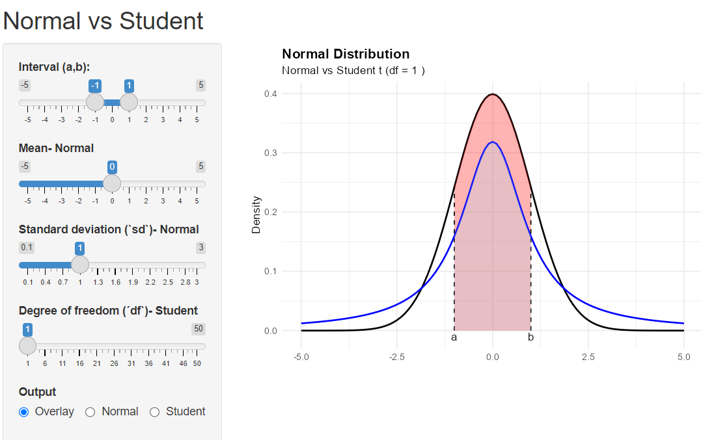
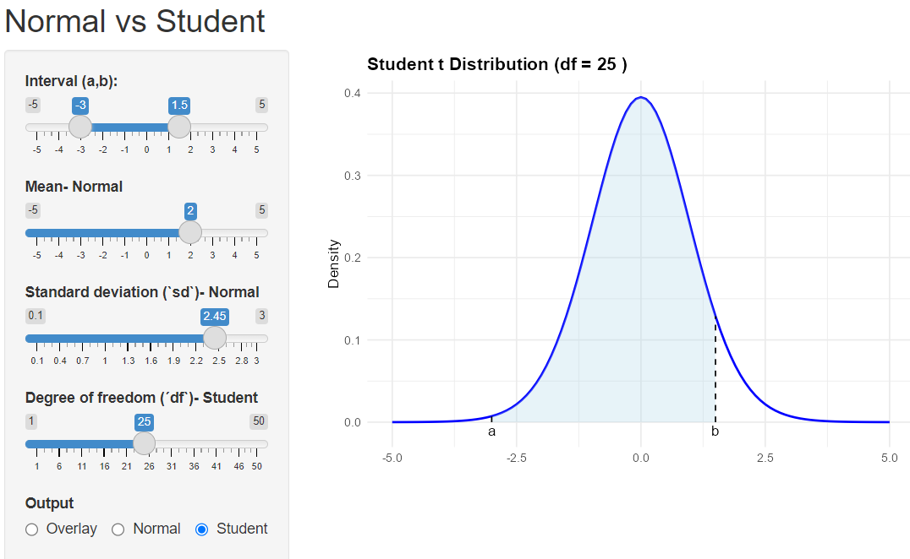

# Normal vs Student Explorer

An interactive **Shiny** application for exploring and comparing the **Normal** and **Student's t** distributions.

The app allows users to:

- Visualize the Normal distribution.
- Visualize the Student's t distribution.
- Overlay both distributions for direct comparison.
- Compute and display probabilities within a selected interval.
- Explore the effects of changing:
  - Mean (`μ`) of the Normal distribution.
  - Standard deviation (`σ`) of the Normal distribution.
  - Degrees of freedom (`df`) of the Student's t distribution.

---

## Screenshots

### Overlay Mode



### Normal Distribution


### Student's t Distribution



---

## Features

### Interactive Controls

- **Interval (a, b)**  
  Select the region of interest. The shaded area represents the probability

  \[
  P(a < X < b)
  \]

- **Mean (Normal Distribution)**  
  Adjust the center of the Normal distribution.

- **Standard Deviation (Normal Distribution)**  
  Control the spread of the Normal distribution.

- **Degrees of Freedom (Student's t Distribution)**  
  Explore how the Student's t distribution approaches the Normal distribution as `df` increases.

- **Output Mode**
  - Overlay
  - Normal
  - Student

### Probability Visualization

The selected interval is highlighted and the corresponding probability is displayed directly on the plot.

---

## Statistical Background

### Normal Distribution

The Normal distribution is defined by two parameters:

- Mean (`μ`)
- Standard deviation (`σ`)

\[
X \sim N(\mu,\sigma^2)
\]

### Student's t Distribution

The Student's t distribution depends on the number of degrees of freedom (`df`).

\[
T \sim t(df)
\]

For small values of `df`, the distribution has heavier tails than the Normal distribution. As `df` increases, it converges to the Normal distribution.

---

## Installation

### Required Packages

```r
install.packages(c(
  "shiny",
  "ggplot2",
  "bslib"
))
```

---

## Running the App

Clone the repository:

```bash
git clone https://github.com/Mateus-Auza/Normal-vs-Student-Explorer.git
```

Open `App.R` in RStudio and run:

```r
source("App.R")
runPlotDens()
```

Alternatively, click **Run App** in RStudio.

---

## Project Structure

```text
Normal-vs-Student-Explorer/
│
├── App.R
├── README.md
└── screenshots/
    ├── normal.png
    ├── overlay.png
    └── student.png
```

---

## Educational Uses

This application is useful for:

- Introductory Statistics courses.
- Probability theory demonstrations.
- Teaching confidence intervals and hypothesis testing.
- Understanding the relationship between the Normal and Student's t distributions.
- Exploring the effect of degrees of freedom on distribution shape.

---

## Author
Mateus Auza Cruz


Developed as a simple interactive tool for teaching and exploring probability distributions using **R**, **ggplot2**, and **Shiny**.
