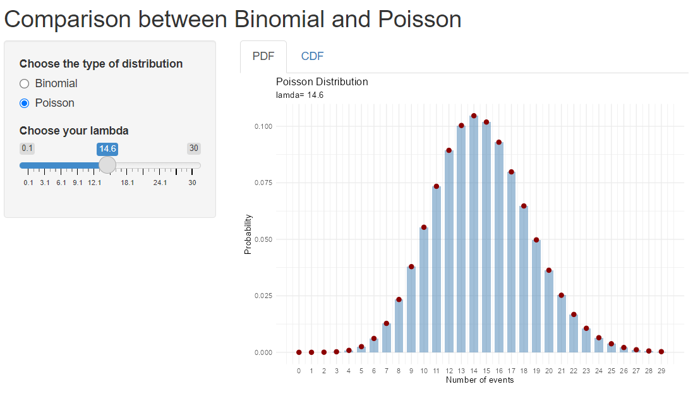
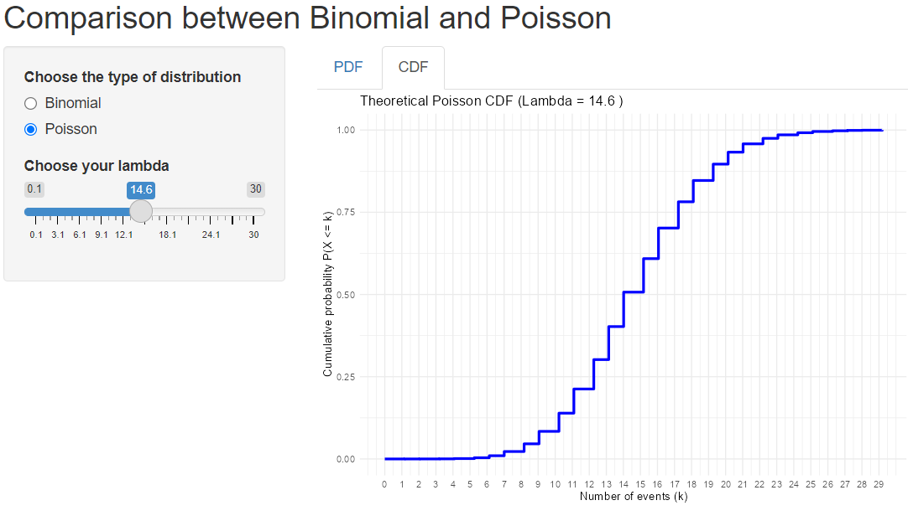

# Shiny Statistics Apps

A collection of interactive **R Shiny** and **Quarto Dashboard** applications designed for teaching and exploring fundamental concepts in **Probability** and **Statistics**.

The goal of this repository is to provide simple, intuitive, and visually appealing tools that help students understand statistical distributions through interactive experimentation.

---

## Applications

### 1. Normal vs Student Explorer

An interactive Shiny application for exploring and comparing the **Normal** and **Student's t** distributions.

#### Features

- Compare Normal and Student's t distributions side-by-side.
- Overlay both distributions for direct visual comparison.
- Explore the impact of:
  - Mean (`μ`)
  - Standard deviation (`σ`)
  - Degrees of freedom (`df`)
- Compute probabilities over a selected interval.
- Visualize how the Student's t distribution converges to the Normal distribution as `df` increases.

#### Preview

| Overlay | Normal | Student |
|----------|----------|----------|
|  |  |  |

---

### 2. Binomial-Poisson Explorer

An interactive Shiny application and Quarto Dashboard for exploring two fundamental discrete probability distributions:

- Binomial Distribution
- Poisson Distribution

#### Features

- Interactive parameter selection.
- Visualization of:
  - Probability Mass Functions (PMF)
  - Cumulative Distribution Functions (CDF)
- Explore:
  - Number of trials (`n`)
  - Probability of success (`p`)
  - Rate parameter (`λ`)
- Understand the relationship between Binomial and Poisson models.

#### Preview

| Binomial PMF | Binomial CDF |
|-------------|-------------|
|  |  |

| Poisson PMF | Poisson CDF |
|-------------|-------------|
|  |  |

---

## Repository Structure

```text
shiny-statistics-app/
│
├── Binomial-Poisson-Explorer/
│   ├── App.R
│   ├── Dashboard.qmd
│   ├── README.md
│   └── screenshots/
│       ├── binomial-cdf.png
│       ├── binomial-pdf.png
│       ├── poisson-cdf.png
│       └── poisson-pdf.png
│
├── Normal-vs-Student-Explorer/
│   ├── App.R
│   ├── README.md
│   └── screenshots/
│       ├── normal.png
│       ├── overlay.png
│       └── student.png
│
├── LICENSE
└── README.md
```

---

## Installation

Install the required packages:

```r
install.packages(c(
  "shiny",
  "ggplot2",
  "bslib"
))
```

If you want to run the Quarto dashboard:

```r
install.packages("quarto")
```

---

## Running the Applications

### Normal vs Student Explorer

```r
setwd("Normal-vs-Student-Explorer")
source("App.R")
runPlotDens()
```

### Binomial-Poisson Explorer

```r
setwd("Binomial-Poisson-Explorer")
shiny::runApp()
```

### Binomial-Poisson Dashboard

Render the Quarto dashboard:

```r
quarto::quarto_render("Dashboard.qmd")
```

---

## Educational Objectives

These applications are intended for:

- Introductory Probability courses
- Introductory Statistics courses
- Statistical inference teaching
- Distribution theory demonstrations
- Self-study and interactive learning
- Classroom demonstrations

Topics covered include:

- Normal distributions
- Student's t distributions
- Binomial distributions
- Poisson distributions
- Probability Mass Functions (PMF)
- Cumulative Distribution Functions (CDF)
- Degrees of freedom
- Probability calculations

---

## Technologies

- R
- Shiny
- Quarto
- ggplot2
- bslib

---

## License

This project is distributed under the terms of the LICENSE file included in this repository.

---

## Author

**Mateus Auza Cruz**

Statistician and data scientist interested in creating open educational tools for teaching statistics and probability through interactive visualizations.
